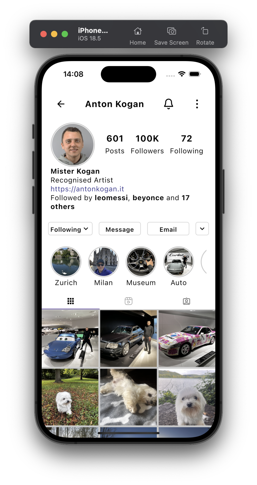

# Instagram UI with Kotlin Multiplatform and Compose Multiplatform

This project demonstrates how to use Kotlin Multiplatform together with Compose Multiplatform to create a cross-platform UI application that runs on both Android and iOS.

## Project Overview

The goal of this project is to showcase the capabilities of Kotlin Multiplatform and Compose Multiplatform by implementing a simplified Instagram profile UI clone. The application features:

- A single UI screen (ProfileScreen) that mimics Instagram's profile page
- Hardcoded strings and images for simplicity
- Cross-platform UI implementation that works on both Android and iOS

## Screenshots

| Android                                                                                   | iOS                                                   |
|-------------------------------------------------------------------------------------------|-------------------------------------------------------|
|  |  |

## Implementation Details

This project intentionally uses a simple approach:
- No architectural patterns like MVI were used
- No ViewModel layer was implemented
- Just a direct UI implementation with Compose Multiplatform

The UI includes common Instagram profile elements:
- Profile header with user information
- Stats section (posts, followers, following)
- Action buttons (Following, Message, etc.)
- Story highlights
- Post grid view

## Project Structure

* [/composeApp](./composeApp/src) contains the shared code for Compose Multiplatform applications:
  - [commonMain](./composeApp/src/commonMain/kotlin) has the shared UI implementation
  - Platform-specific code is in the respective platform folders

* [/iosApp](./iosApp) contains the iOS application entry point

## Learn More

- [Kotlin Multiplatform](https://www.jetbrains.com/help/kotlin-multiplatform-dev/get-started.html)
- [Compose Multiplatform](https://www.jetbrains.com/lp/compose-multiplatform/)